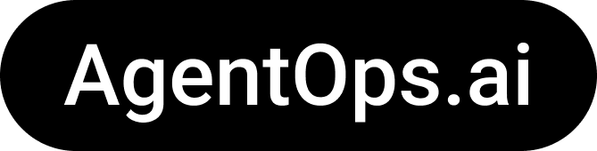

<div align="center">
  
</div>
<p align="center">
  <em>AI agents suck. We’re fixing that.</em>
</p>

<p align="center">
    <a href="https://pypi.org/project/agentops/" target="_blank">
        
        
    </a>
</p>
<p align="center">
<a href="https://twitter.com/agentopsai/">🐦 Twitter</a>
<span>&nbsp;&nbsp;•&nbsp;&nbsp;</span>
<a href="https://discord.gg/JHPt4C7r">📢 Discord</a>
<span>&nbsp;&nbsp;•&nbsp;&nbsp;</span>
<a href="https://app.agentops.ai/?=gh">🖇️ AgentOps</a>
<span>&nbsp;&nbsp;•&nbsp;&nbsp;</span>
<a href="https://docs.agentops.ai/introduction">📙 Documentation</a>
</p>

# AgentOps

Build your next agent with benchmarks, observability, and replay analytics. AgentOps is the toolkit for evaluating and developing robust and reliable AI agents.

AgentOps is open beta. You can sign up for AgentOps [here](https://app.agentops.ai).

[](https://opensource.org/licenses/MIT) 
 
 
<a href="https://twitter.com/agentopsai">

</a>
<a href="https://discord.gg/mKW3ZhN9p2">

</a>
<a href="mailto:investor@agentops.ai"></a>
<a href="https://github.com/agentops-ai/agentops/issues">

</a>


> 🚨 NOTE: This Typescript library is still in alpha and does not currently support many of the functionalities available 
> with the [python SDK](https://github.com/AgentOps-AI/agentops). If possible, using Python is recommended.

## Quick Start
Install AgentOps
```npm install agentops```

Add AgentOps to your code. Check out an [example](https://github.com/AgentOps-AI/agentops-node/blob/main/example/index.ts).
```javascript
import OpenAI from "openai";
import { Client } from 'agentops';

const openai = new OpenAI();                        // Add your API key here or in the .env

const agentops = new Client({
    apiKey: "<Insert AgentOps API Key>",            // Add your API key here or in the .env
    tags: ["abc", "success"],                       // Optionally add tags to your run
    patchApi: [openai]                              // Record LLM calls automatically (Only OpenAI is currently supported)
});

// agentops.patchApi(openai)                        // Alternatively, you can patch API calls later

// Sample OpenAI call (automatically recorded if specified in "patched")
async function chat() {
    const completion = await openai.chat.completions.create({
        messages: [{ "role": "system", "content": "You are a helpful assistant." },
        { "role": "user", "content": "Who won the world series in 2020?" },
        { "role": "assistant", "content": "The Los Angeles Dodgers won the World Series in 2020." },
        { "role": "user", "content": "Where was it played?" }],
        model: "gpt-3.5-turbo",
    });

    return completion
}

// Sample other function
function orignal(x: string) {
    console.log(x);
    return 5;
}

// You can track other functions by wrapping the function.
const wrapped = agentops.wrap(orignal);
wrapped("hello");


chat().then(() => {
    agentops.endSession("Success"); // Make sure you end your session when your agent is done.
});

```


## Time travel debugging 🔮
(coming soon!)

## Agent Arena 🥊
(coming soon!)

## Evaluations Roadmap 🧭

| Platform | Dashboard | Evals |
|---|---|---|
|✅ Python SDK | ✅ Multi-session and Cross-session metrics | 🚧 Evaluation playground + leaderboard |
|🚧 Evaluation builder API | ✅ Custom event tag tracking | 🔜 Agent scorecards |
|✅ Javascript/Typescript SDK | 🚧 Session replays| 🔜 Custom eval metrics |


## Debugging Roadmap 🧭

| Performance testing | Environments | LAA (LLM augmented agents) specific tests | Reasoning and execution testing |
|---|---|---|---|
|✅ Event latency analysis | 🔜 Non-stationary environment testing | 🔜 LLM non-deterministic function detection | 🚧 Infinite loops and recursive thought detection |
|✅ Agent workflow execution pricing | 🔜 Multi-modal environments | 🔜 Token limit overflow flags | 🔜 Faulty reasoning detection |
|🔜 Success validators (external) | 🔜 Execution containers | 🔜 Context limit overflow flags | 🔜 Generative code validators |
|🔜 Agent controllers/skill tests | 🔜 Honeypot and prompt injection evaluation | 🔜 API bill tracking | 🔜 Error breakpoint analysis |
|🔜 Information context constraint testing | 🔜 Anti-agent roadblocks (i.e. Captchas) | | |
|🔜 Regression testing | | | |


### Why AgentOps? 🤔

Our mission is to make sure your agents are ready for production.

Agent developers often work with little to no visibility into agent testing performance. This means their agents never leave the lab. We're changing that. 

AgentOps is the easiest way to evaluate, grade, and test agents. Is there a feature you'd like to see AgentOps cover? Just raise it in the issues tab, and we'll work on adding it to the roadmap.
